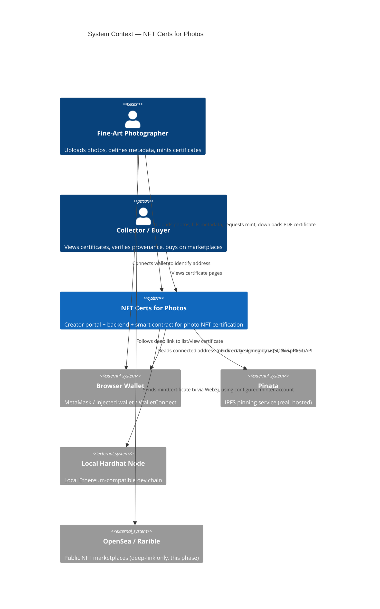
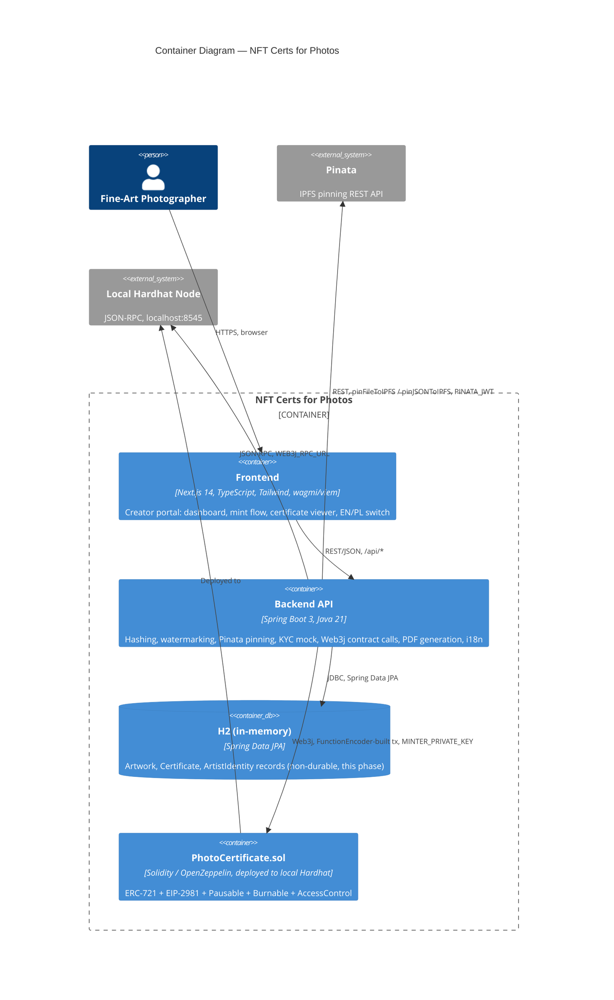

# 03 — Architecture

## 1. System Context (C4 Level 1)



## 2. Container Diagram (C4 Level 2)



## 3. Component Responsibilities

### 3.1 `contracts/` — Hardhat + Solidity

- Single contract `PhotoCertificate.sol` implementing ERC-721, EIP-2981, `Pausable`,
  `ERC721Burnable`, and `AccessControl`.
- Owns the canonical on-chain record: token ownership, content-hash registry (duplicate
  protection), royalty configuration, pause state.
- Deployed only to a local Hardhat network for this phase (see
  [09-deployment-and-devops.md](./09-deployment-and-devops.md)).
- Full design: [06-smart-contract-design.md](./06-smart-contract-design.md).

### 3.2 `backend/` — Spring Boot 3 (Java 21), package `com.gandarych.nftcerts`

- **`HashingService`** — streaming SHA-256 hashing of uploaded files (NFR-1).
- **`WatermarkService`** — embeds content hash + artist DID into image EXIF/XMP metadata via
  Apache Commons Imaging.
- **`IpfsStorageService`** (interface) — real Pinata implementation (`pinFileToIPFS`,
  `pinJSONToIPFS`) for production/e2e use; a local-disk fake implementation for offline unit tests
  only, never used on the real run path.
- **`KycVerificationService`** (interface) — mock auto-approving implementation; documented
  swap-in point for a real provider (Persona/Onfido/Civic).
- **`ContractService`** — Web3j-based; manually ABI-encodes the `mintCertificate` call via
  `FunctionEncoder` (no generated contract wrapper), signs and sends via the configured local
  Hardhat minter account.
- **`CertificatePdfService`** — OpenPDF-based generation of the downloadable certificate document.
- **`ArtworkRepository` / `CertificateRepository`** — Spring Data JPA over H2 in-memory.
- **i18n message bundles** — exposed via `GET /api/i18n/{lang}` for the frontend flag switcher.
- Full API contract: [05-api-design.md](./05-api-design.md). Data model:
  [04-data-model.md](./04-data-model.md).

### 3.3 `frontend/` — Next.js 14 (App Router), TypeScript, Tailwind, wagmi v2/viem

- **`/`** — Dashboard: artist's certificates, royalties, ownership history (via
  `GET /api/artists/{walletAddress}/dashboard`).
- **`/mint`** — Drag-and-drop upload with live client-side SHA-256 (Web Crypto API) + metadata
  form (title, description, medium, year, royalty %).
- **`/certificate/[id]`** — PDF download, Etherscan-equivalent/IPFS links, OpenSea/Rarible deep
  links, plain-language educational panel.
- Wallet connection via wagmi/viem (MetaMask/injected primary; WalletConnect optional, its own
  project ID env var).
- All contract interaction is backend-mediated; the frontend never signs mint transactions
  directly against the contract in this phase.
- Flag-icon EN/PL switcher backed by `GET /api/i18n/{lang}`.

## 4. Tech Stack Rationale

| Layer | Choice | Rationale |
|-------|--------|-----------|
| Smart contracts | Hardhat + OpenZeppelin + Solidity | Industry-standard tooling; OpenZeppelin gives audited, composable ERC-721/ERC2981/Pausable/AccessControl building blocks instead of hand-rolled token logic (NFR-9). |
| Backend | Spring Boot 3, Java 21 | Matches the Java-developer audience of this course; mature ecosystem for REST APIs, JPA, and Web3j integration; virtual-thread-ready Java 21 for I/O-bound Pinata/RPC calls. |
| Chain client (backend) | Web3j, manual ABI encoding via `FunctionEncoder` | Avoids a codegen build-time dependency on contract artifacts; keeps the backend decoupled from contract compilation output and makes the ABI encoding explicit and inspectable for teaching purposes. See ADR in [10-glossary-and-decisions.md](./10-glossary-and-decisions.md). |
| Storage | Pinata (real) | Managed IPFS pinning, simple REST API, generous free tier suitable for a course; avoids operating a self-hosted IPFS node or Arweave bundler. This is explicitly **not** a simplification — it is the real integration. |
| Persistence | H2 in-memory (Spring Data JPA) | Zero external dependency for local development and grading; documented limitation that data does not survive a restart. |
| PDF generation | OpenPDF | Pure-Java, no headless-browser dependency, lightweight for certificate rendering. |
| Frontend framework | Next.js 14 App Router + TypeScript | Modern React server/client component model; strong TypeScript support; large Web3-frontend ecosystem compatibility. |
| Styling | Tailwind CSS | Fast, consistent utility styling without a heavy design-system dependency for a reference implementation. |
| Wallet/Web3 (frontend) | wagmi v2 + viem | Current idiomatic React hooks-based Web3 stack; typed, tree-shakeable, actively maintained successor to ethers-based patterns. |
| Identity | Mock `KycVerificationService` | Keeps the demo self-contained; interface designed so a real KYC/DID provider can be substituted without changing callers. |

## 5. Monorepo Layout

```
app01_java_nft/
├── contracts/                  # Hardhat + Solidity
│   ├── contracts/
│   │   └── PhotoCertificate.sol
│   ├── test/                   # Chai/ethers contract tests
│   ├── scripts/                # Local deploy scripts (Hardhat network only)
│   └── hardhat.config.ts
├── backend/                    # Spring Boot 3, Java 21, Maven
│   ├── src/main/java/com/gandarych/nftcerts/
│   │   ├── upload/              # HashingService, WatermarkService
│   │   ├── storage/              # IpfsStorageService (Pinata impl + local fake)
│   │   ├── identity/              # KycVerificationService (mock)
│   │   ├── contract/              # ContractService (Web3j)
│   │   ├── certificate/           # CertificatePdfService, Certificate entity
│   │   ├── artwork/                # Artwork entity, ArtworkService
│   │   └── i18n/                    # message bundle controller
│   ├── src/main/resources/
│   │   ├── application.yml
│   │   └── i18n/messages_en.properties, messages_pl.properties
│   └── src/test/java/...          # JUnit5 + Mockito + MockMvc
├── frontend/                    # Next.js 14 App Router
│   ├── app/
│   │   ├── page.tsx               # Dashboard
│   │   ├── mint/page.tsx          # Certificate Creator
│   │   └── certificate/[id]/page.tsx
│   ├── components/
│   ├── lib/                       # wagmi config, api client, i18n
│   └── public/
└── docs/sdlc/                    # This documentation set (01-10)
```

## 6. Trust Boundaries (summary; full detail in threat model)

- **Browser ↔ Backend**: untrusted input boundary; all file uploads, metadata, and mint requests
  are validated server-side regardless of client-side checks. See
  [07-security-and-threat-model.md](./07-security-and-threat-model.md).
- **Backend ↔ Pinata**: authenticated via `PINATA_JWT`/API key-secret; backend is the only holder
  of these credentials.
- **Backend ↔ Local Hardhat Node**: backend is the sole holder of `MINTER_PRIVATE_KEY`; the
  frontend/user wallet never signs the mint transaction in this phase.

## Related Documents

- [01-vision-and-scope.md](./01-vision-and-scope.md)
- [04-data-model.md](./04-data-model.md)
- [05-api-design.md](./05-api-design.md)
- [06-smart-contract-design.md](./06-smart-contract-design.md)
- [09-deployment-and-devops.md](./09-deployment-and-devops.md)
