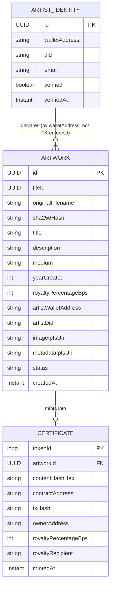
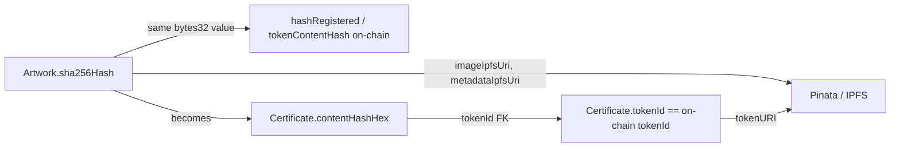

# 04 — Data Model

This document covers two distinct storage layers: the backend's off-chain relational model
(Spring Data JPA over H2, see [09-deployment-and-devops.md](./09-deployment-and-devops.md) for the
in-memory limitation) and the smart contract's on-chain storage layout. The two are linked by
`contentHash` (SHA-256 of the image) and `tokenId`.

## 1. Backend JPA Entities

### 1.1 `Artwork`

Represents an uploaded photograph after hashing and watermarking, before (or after) it has been
pinned to IPFS and minted.

| Field | Type | Notes |
|-------|------|-------|
| `id` | `UUID` (PK) | `artworkId` in API responses |
| `fileId` | `UUID` | Reference to the upload produced by `POST /api/uploads` |
| `originalFilename` | `String` | As received from the client |
| `sha256Hash` | `String` (hex, 64 chars) | Computed by `HashingService`; unique index |
| `title` | `String` | Artist-provided |
| `description` | `String` (text) | Artist-provided |
| `medium` | `String` | e.g. "Archival pigment print", "Digital photograph" |
| `yearCreated` | `Integer` | Artist-provided |
| `royaltyPercentageBps` | `Integer` | Basis points (100 = 1%); validated 0–10000 |
| `artistWalletAddress` | `String` (EVM address) | Owner/minter-recipient candidate |
| `artistDid` | `String` | Decentralized identifier of the artist, embedded in the watermark |
| `imageIpfsUri` | `String`, nullable | Set once pinned to Pinata (`ipfs://...`) |
| `metadataIpfsUri` | `String`, nullable | Set once the metadata JSON is pinned |
| `status` | `enum` (`UPLOADED`, `PINNED`, `MINTED`) | Lifecycle state |
| `createdAt` | `Instant` | Audit timestamp |

Relationships: one `Artwork` has zero-or-one `Certificate` (an artwork becomes a certificate once
minted).

### 1.2 `Certificate`

Represents a successfully minted on-chain NFT and mirrors the essential on-chain facts for fast
API reads (the chain remains the source of truth; this is a read-optimized cache/record).

| Field | Type | Notes |
|-------|------|-------|
| `tokenId` | `Long` (PK) | On-chain token ID returned by `mintCertificate` |
| `artwork` | `Artwork` (FK, one-to-one) | The source artwork |
| `contentHashHex` | `String` (64 hex chars) | Duplicated from `Artwork.sha256Hash` for fast lookup; must equal `tokenContentHash(tokenId)` on-chain |
| `contractAddress` | `String` (EVM address) | Deployed `PhotoCertificate` address for this environment |
| `txHash` | `String` | Mint transaction hash |
| `ownerAddress` | `String` (EVM address) | Recipient of the mint (`recipientAddress` from the mint request) |
| `royaltyPercentageBps` | `Integer` | Mirrors on-chain `royaltyInfo` numerator, for display without an RPC round trip |
| `royaltyRecipient` | `String` (EVM address) | Who receives secondary-sale royalties |
| `mintedAt` | `Instant` | Audit timestamp |

Derived (not stored, computed at read time): `etherscanUrl`, `openSeaUrl`, `raribleUrl` — built
from `contractAddress` + `tokenId` and the configured chain/marketplace base URLs. See
[05-api-design.md](./05-api-design.md).

### 1.3 `ArtistIdentity`

Represents the result of the mock KYC/DID verification flow (`POST /api/identity/verify`),
kept so the mint endpoint can check that an artist has been verified before minting on their
behalf.

| Field | Type | Notes |
|-------|------|-------|
| `id` | `UUID` (PK) | |
| `walletAddress` | `String` (EVM address) | Unique index |
| `did` | `String` | Decentralized identifier, e.g. `did:key:z6Mk...` |
| `email` | `String` | Contact info collected at verification time (mock flow only) |
| `verified` | `boolean` | Always `true` from the mock `KycVerificationService` in this phase |
| `verifiedAt` | `Instant` | Audit timestamp |

### 1.4 Entity Relationship Diagram

Note: `ArtistIdentity` is linked to `Artwork`/`Certificate` by matching `walletAddress`, not a
hard foreign key, since verification is a precondition check performed at mint time rather than a
structural parent record.

## 2. On-Chain Storage Layout — `PhotoCertificate.sol`

Full contract design and rationale: [06-smart-contract-design.md](./06-smart-contract-design.md).
This section documents storage shape only.

| Storage item | Type | Purpose |
|---------------|------|---------|
| `hashRegistered` | `mapping(bytes32 => bool)` | Duplicate-photo protection; set `true` when a `contentHash` is minted, checked and reverted-on-collision in `mintCertificate`. |
| `_tokenContentHash` | `mapping(uint256 => bytes32)` | Per-token content hash, exposed via `tokenContentHash(uint256) view returns (bytes32)`. |
| `_tokenIdCounter` | internal counter | Monotonically increasing token ID assignment (implementation detail; not part of the public interface). |
| Role storage (via `AccessControl`) | `mapping(bytes32 => RoleData)` | Standard OpenZeppelin `AccessControl` storage for `DEFAULT_ADMIN_ROLE`, `MINTER_ROLE`, `PAUSER_ROLE`. |
| Royalty storage (via `ERC2981`) | per-token and default royalty info (`RoyaltyInfo` struct: `receiver`, `royaltyFraction`) | Standard OpenZeppelin `ERC2981` storage, set per token inside `mintCertificate`. |
| Pause state (via `Pausable`) | `bool _paused` | Standard OpenZeppelin `Pausable` storage; gates `mintCertificate` and (via `_update`/`_beforeTokenTransfer` hook) transfers. |
| Ownership/approvals (via `ERC721`) | standard OpenZeppelin `ERC721` storage (`_owners`, `_balances`, `_tokenApprovals`, `_operatorApprovals`) | Standard NFT ownership bookkeeping. |
| `metadataURI` per token | via `ERC721URIStorage`-style mapping or base `_tokenURIs` | IPFS URI to the metadata JSON, returned by `tokenURI(uint256)`. |

### Roles

| Role | Constant | Granted to (this phase) | Purpose |
|------|----------|---------------------------|---------|
| Default admin | `DEFAULT_ADMIN_ROLE` | Deployer (course instructor account) | Can grant/revoke all other roles |
| Minter | `MINTER_ROLE` | Backend's configured minter account (`MINTER_PRIVATE_KEY`) | Only role allowed to call `mintCertificate` |
| Pauser | `PAUSER_ROLE` | Deployer / platform operator account | Can `pause()`/`unpause()` in response to legal copyright claims |

### Off-chain ↔ On-chain Linkage

## Related Documents

- [03-architecture.md](./03-architecture.md)
- [05-api-design.md](./05-api-design.md)
- [06-smart-contract-design.md](./06-smart-contract-design.md)
