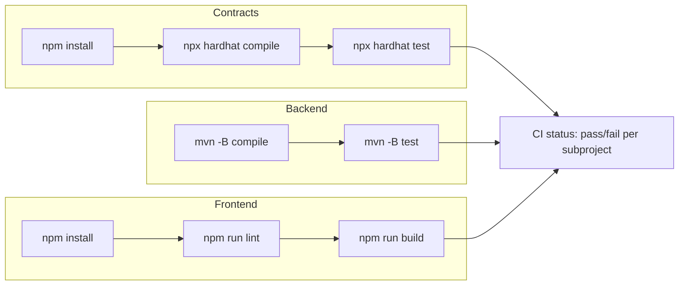

# 09 — Deployment and DevOps

## 1. Local Development Setup

Prerequisites: Node.js (for Hardhat and the frontend), JDK 21, Maven, and a Pinata account (free
tier is sufficient) for real end-to-end runs.

### 1.1 Contracts

```bash
cd contracts
npm install
npx hardhat node                 # terminal 1: keep running, local chain on :8545
npx hardhat run scripts/deploy.ts --network localhost   # terminal 2: deploy PhotoCertificate
npx hardhat test                 # unit tests, in-memory network, no node required
```

Deploying prints the contract address and the deployer/minter account address — these feed into
the backend's `NFT_CONTRACT_ADDRESS` and must match the account behind `MINTER_PRIVATE_KEY`.

### 1.2 Backend

```bash
cd backend
mvn test                         # unit tests only: local fake storage, no live chain/Pinata needed
mvn spring-boot:run              # real run: requires env vars below to be set
```

### 1.3 Frontend

```bash
cd frontend
npm install
npm run build                    # production build check
npm run dev                      # local dev server
```

### 1.4 Full Local Smoke Test

See [08-test-plan.md](./08-test-plan.md) §4 for the complete manual walkthrough (hardhat node →
deploy → backend with real `PINATA_JWT` → frontend → upload → mint → certificate).

## 2. Required Environment Variables (Backend, Real Run)

These are required only for the "real" run path (real Pinata pinning, real local-chain minting);
the unit-test suite (`mvn test`) uses fakes and needs none of them (NFR-4).

| Variable | Purpose | Notes |
|----------|---------|-------|
| `PINATA_JWT` | Bearer auth for Pinata REST API (`pinFileToIPFS`, `pinJSONToIPFS`) | **Preferred** over the key/secret pair below. Only required when `app.storage.provider=pinata` (the default). |
| `PINATA_API_KEY` / `PINATA_API_SECRET` | Alternative Pinata auth pair | Used only if `PINATA_JWT` is not set. Only required when `app.storage.provider=pinata`. |
| `WEB3J_RPC_URL` | JSON-RPC endpoint for the chain the backend talks to | Default `http://localhost:8545` (local Hardhat node). |
| `MINTER_PRIVATE_KEY` | Signs the `mintCertificate` transaction | Must be a **well-known Hardhat test-only account key** for this phase. Never a real-funds key — see [07-security-and-threat-model.md](./07-security-and-threat-model.md) T-1. |
| `NFT_CONTRACT_ADDRESS` | Deployed `PhotoCertificate` address to target | Printed by the Hardhat deploy script. |

### 2.1 Storage Provider Switch

`app.storage.provider` (config property, overridable via env var `APP_STORAGE_PROVIDER`) selects
the `IpfsStorageService` implementation at runtime, independent of Spring profiles:

| Value | Behavior |
|-------|----------|
| `pinata` (default) | Real Pinata pinning. `PINATA_JWT` (or the key/secret pair) is required; the app fails fast at startup if missing. |
| `mock` | Uses the local-disk fake storage implementation. No Pinata credentials are read or required — the app starts cleanly with none set. Intended for demos, offline development, or environments without a Pinata account. |

The active provider is logged at startup (info level) so the running mode is never ambiguous.
This is a deliberate, always-available switch (not just a test-only fake) — see ADR-1 in
[10-glossary-and-decisions.md](./10-glossary-and-decisions.md).

**Secret handling rule (non-negotiable):** all of the above must be supplied via a gitignored
`.env` file or real environment variables/secret manager — never committed to source control. The
backend must fail fast at startup with a clear, actionable error message if any required variable
is missing under the "real" (non-test) profile with `app.storage.provider=pinata` (NFR-3), rather
than surfacing a confusing failure on the first Pinata/chain call. See `app01_java_nft/AGENTS.md`
and the repo-root `.gitignore` for the current convention.

## 3. CI Outline

A per-subproject CI pipeline (exact CI provider/config is an implementation-phase decision; this
is the outline to implement against):



Principles:

- Each subproject (`contracts/`, `backend/`, `frontend/`) lints and tests independently; a failure
  in one does not block running the others, so contributors get full feedback in one CI run
  (NFR-11).
- No CI job requires real Pinata credentials or a live chain — all automated tests use fakes/mocks
  or Hardhat's in-memory network (NFR-4). CI, therefore, never needs `PINATA_JWT` or
  `MINTER_PRIVATE_KEY` as secrets.
- CI does not deploy anywhere (no testnet/mainnet job exists yet — see promotion path below).

## 4. Promotion Path (Future — Not Yet Executed)

This phase deploys **only** to a local Hardhat network. The following promotion path is documented
for future phases and is explicitly **not** implemented or scheduled yet:

| Stage | Chain target | Status |
|-------|---------------|--------|
| Local (current) | Hardhat local network, ephemeral, test accounts only | **Active — this phase** |
| Testnet (future) | A public EVM testnet (e.g., Sepolia) | Not yet executed. Would require: a funded testnet deployer key managed via a secret manager (not `.env`), contract verification on a public block explorer, replacing the placeholder `etherscanUrl` construction in [05-api-design.md](./05-api-design.md) with a real explorer link, and re-running the full Hardhat test suite against the deployed testnet address. |
| Mainnet (future) | Ethereum mainnet or an L2 (e.g., Base, Polygon) | Not yet executed. Would additionally require: a third-party contract security audit, real KYC provider integration (replacing the mock — see [10-glossary-and-decisions.md](./10-glossary-and-decisions.md)), a production-grade key-custody solution (HSM/KMS/multisig) replacing `MINTER_PRIVATE_KEY` as a plain env var, and a durable production database replacing H2 in-memory persistence. |

No task in this repository should assume any stage beyond "Local" is active until this document is
explicitly updated to reflect a real promotion.

## 5. Known Operational Limitations (This Phase)

- **H2 in-memory persistence**: all `Artwork`/`Certificate`/`ArtistIdentity` records are lost on
  backend restart. This is acceptable for local development/course use and is not a target for
  fixing within this phase (see ADR in
  [10-glossary-and-decisions.md](./10-glossary-and-decisions.md)).
- **Local Hardhat chain only**: contract state (including `hashRegistered`) also resets whenever
  the Hardhat node restarts, since it is an ephemeral in-memory chain.
- **No containerization defined yet**: this phase assumes local processes (`mvn spring-boot:run`,
  `npx hardhat node`, `npm run dev`) rather than Docker Compose; containerization can be added in a
  later phase without affecting this document's architecture decisions.

## Related Documents

- [03-architecture.md](./03-architecture.md)
- [07-security-and-threat-model.md](./07-security-and-threat-model.md)
- [08-test-plan.md](./08-test-plan.md)
- [10-glossary-and-decisions.md](./10-glossary-and-decisions.md)
